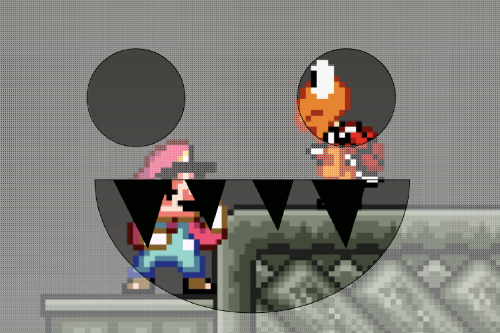
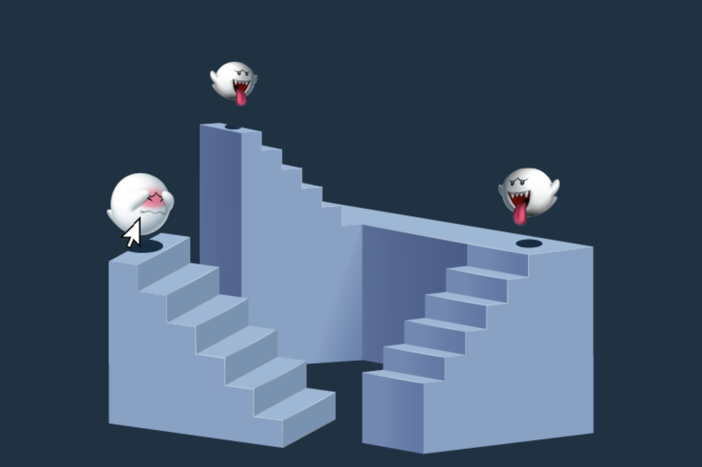
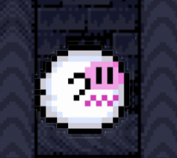
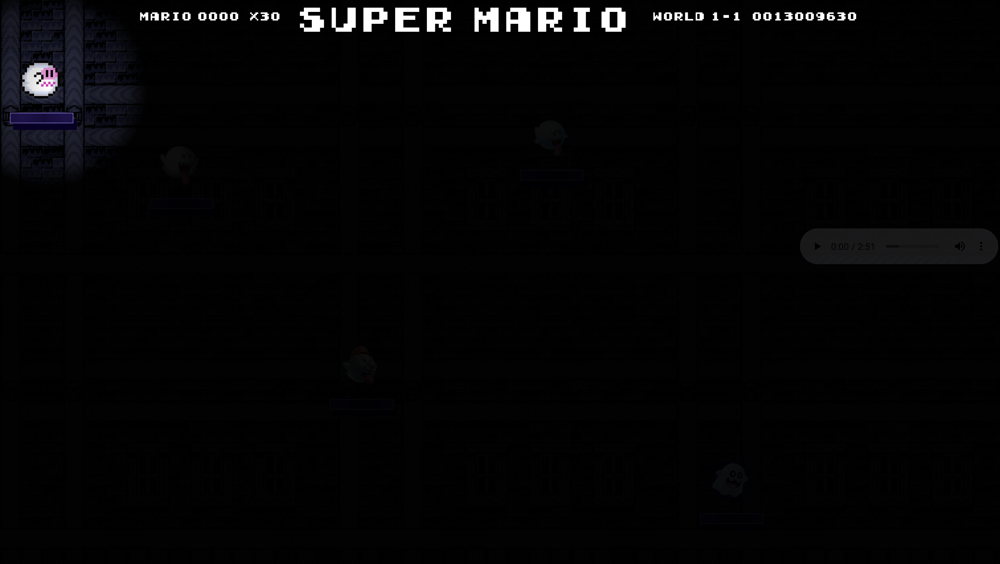

# Procesverslag
Markdown is een simpele manier om HTML te schrijven.  
Markdown cheat cheet: [Hulp bij het schrijven van Markdown](https://github.com/adam-p/markdown-here/wiki/Markdown-Cheatsheet).

Nb. De standaardstructuur en de spartaanse opmaak van de README.md zijn helemaal prima. Het gaat om de inhoud van je procesverslag. Besteedt de tijd voor pracht en praal aan je website.

Nb. Door *open* toe te voegen aan een *details* element kun je deze standaard open zetten. Fijn om dat steeds voor de relevante stuk(ken) te doen.

## Jij

### Ontwerper:
Nathan Stuger

#### Je startniveau:
Mijn startniveau is: blauw

# Je plan

  
De eerste versie/schets van je ontwerp & je persoonlijke uitdaging

  ### De eerste versie/schets:
  
  
  
  
  
  
  
  
  
  

  ### Je ambitie: 
  Aan deze technieken/punten wil ik werken:
  1. Verdiepen in de verschillende bruikbare elementen, ik gebruik vaak dezelfde elementen terwijl er een hoop andere gebruikt kunnen worden.
  2. Zo min mogelijk gebruik maken van classes en Id's
  3. Ik zou graag meer willen doen met javascript, ik heb hier voor een bepaalde tijd niet veel mee gedaan. 
  
 
  
  

## Voortgang/Feedback 1

  
Mijn bevindingen + wijzigingen (minimaal 5)

  ### Bevinding 1:
  In mijn eerste concept is te zien dat de achtergrond waarop de spoken staan een basis kleur heeft. Dit geeft niet echt goed de sfeer van Mario weer.

  #### oplossing:
  Een wat levendigere achtergrond gebruiken, wellicht een achtergrond uit het echte spel.

  ### Bevinding 2:
  In het tweede scherm komt het beeld niet helemaal naar voren, dit komt door de overlay van het spook. De tanden blokkeren een hoop van de afbeelding. 

  #### oplossing:
 Het eerste concept wat minder op de voorgrond zetten en zorgen dat de tekst + afbeelding goed tot zijn recht komt. 

 ### Bevinding 3:
  Ik heb steeds hetzelfde spook terug laten komen waardoor het effect van minder duidelijk overkomt.

  #### oplossing:
 De spoken toevoegen hoewel zijn deze nog niet vrij zijn gemaakt.
 
 
  ### Bevinding 4:
  In mijn eerste concept heb ik trappen gebruikt om de spoken op te "plaatsen". Deze trappen zijn 3D en wil ik graag volledig in CSS maken. Na wat meer onderzoek te hebben gedaan en dit besproken te hebben is dit moeilijker dan gedacht. 
  

  #### oplossing:
 De d3 trappen zijn ingewikkeld om te maken en dat is misschien juist interessant. De stijl is helaas niet echt in de Mario stijl. Het is misschien handiger om iets uit het level van de spoken toe te voegen. 
 
 
  ### Bevinding 5:
 Er is niet echt een interactief aspect hoewel je op de button drukt moet er nog iets zijn dat deze ervaring speciaal maakt. 

  #### oplossing:
 Een hover toevoegen over de spoken met de verschillende versies om het mario effect te na te maken.

## Voortgang/Feedback 2

  
Mijn bevindingen + wijzigingen (minimaal 5)

  
  ### Bevinding 1:
  Omschrijving van wat er nog niet orde was (tekst en afbeeding(en)).

  #### oplossing:
  Beschrijving hoe je het hebt hebt opgelost of als het niet gelukt is hoe je het zou oplossen (tekst en afbeeding(en)).

  ### Bevinding 2:
  Omschrijving van wat er nog niet orde was (tekst en afbeeding(en)).

  #### oplossing:
  Beschrijving hoe je het hebt hebt opgelost of als het niet gelukt is hoe je het zou oplossen (tekst en afbeeding(en)).

  ### Bevinding 3:
  Omschrijving van wat er nog niet orde was (tekst en afbeeding(en)).

  #### oplossing:
  Beschrijving hoe je het hebt hebt opgelost of als het niet gelukt is hoe je het zou oplossen (tekst en afbeeding(en)).
  
   ### Bevinding 4:
  Omschrijving van wat er nog niet orde was (tekst en afbeeding(en)).

  #### oplossing:
  Beschrijving hoe je het hebt hebt opgelost of als het niet gelukt is hoe je het zou oplossen (tekst en afbeeding(en)).
  
  ### Bevinding 5:
  Omschrijving van wat er nog niet orde was (tekst en afbeeding(en)).

  #### oplossing:
  Beschrijving hoe je het hebt hebt opgelost of als het niet gelukt is hoe je het zou oplossen (tekst en afbeeding(en)).
  

## Voortgang/Feedback 3

  
Mijn bevindingen + wijzigingen (minimaal 5)

  
  ### Bevinding 1:
  Omschrijving van wat er nog niet orde was (tekst en afbeeding(en)).

  #### oplossing:
  Beschrijving hoe je het hebt hebt opgelost of als het niet gelukt is hoe je het zou oplossen (tekst en afbeeding(en)).

  ### Bevinding 2:
  Omschrijving van wat er nog niet orde was (tekst en afbeeding(en)).

  #### oplossing:
  Beschrijving hoe je het hebt hebt opgelost of als het niet gelukt is hoe je het zou oplossen (tekst en afbeeding(en)).

   ### Bevinding 3:
  Omschrijving van wat er nog niet orde was (tekst en afbeeding(en)).

  #### oplossing:
  Beschrijving hoe je het hebt hebt opgelost of als het niet gelukt is hoe je het zou oplossen (tekst en afbeeding(en)).
  
   ### Bevinding 4:
  Omschrijving van wat er nog niet orde was (tekst en afbeeding(en)).

  #### oplossing:
  Beschrijving hoe je het hebt hebt opgelost of als het niet gelukt is hoe je het zou oplossen (tekst en afbeeding(en)).
  
   ### Bevinding 5:
  Omschrijving van wat er nog niet orde was (tekst en afbeeding(en)).

  #### oplossing:
  Beschrijving hoe je het hebt hebt opgelost of als het niet gelukt is hoe je het zou oplossen (tekst en afbeeding(en)).

## Reflectie

  
Mijn eindresultaat & persoonlijke ontwikkeling

  ### Je uitkomst - karakteristiek screenshot(s):
  

  ### Dit ging goed/Heb ik geleerd: 
  Korte omschrijving met plaatje(s)

  

  ### Dit was lastig/Is niet gelukt:
  Korte omschrijving met plaatje(s)

  

## Bronnenlijst

continu bijhouden terwijl je werkt

Nb. Wees specifiek ('css-tricks' als bron is bijv. niet specifiek genoeg).

1. bron 1: Flashlight cursor effect Link: https://codepen.io/tomhodgins/pen/egWjBb dit effect kwam er handig uit voor mijn concept. Na het maken van een aantal aanpassingen was werkte dit perfect voor mijn site. 
2. bron 2: Afbeeldingen Dit is de video waaruit ik de verschillende versies van de spoken heb gehaald.https://www.youtube.com/watch?v=JIJ6c_n_tVs 
3. Bron 3 :afbeelding van het laatste spook genaamd "Peepa" https://www.mariowiki.com/Peepa
4. Bron 4: Achtergrond afbeelding https://www.supermariobrosx.org/forums/viewtopic.php?t=11820
5. Bron 5: Dit is de bron van het achtergrond geluid dat ik heb gebruikt voor de site:https://www.youtube.com/watch?v=JIL1T93Y59s

