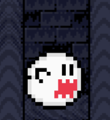

# Procesverslag
Markdown is een simpele manier om HTML te schrijven.  
Markdown cheat cheet: [Hulp bij het schrijven van Markdown](https://github.com/adam-p/markdown-here/wiki/Markdown-Cheatsheet).

Nb. De standaardstructuur en de spartaanse opmaak van de README.md zijn helemaal prima. Het gaat om de inhoud van je procesverslag. Besteedt de tijd voor pracht en praal aan je website.

Nb. Door *open* toe te voegen aan een *details* element kun je deze standaard open zetten. Fijn om dat steeds voor de relevante stuk(ken) te doen.


## Jij

### Ontwerper:
Nathan Stuger

#### Je startniveau:
Mijn startniveau is: Blauw


# Je plan

<details open>
  <summary>De eerste versie/schets van je ontwerp & je persoonlijke uitdaging</summary>

  ### De eerste versie/schets:
  
  
  
  
  
  
  
  
  
  


  ### Je ambitie: 
  Aan deze technieken/punten wil ik werken:
  1. Verdiepen in de verschillende bruikbare elementen, ik gebruik vaak dezelfde elementen terwijl er een hoop andere gebruikt kunnen worden.
  2. Zo min mogelijk gebruik maken van classes en Id's
  3. Ik zou graag meer willen doen met javascript, ik heb hier voor een bepaalde tijd niet veel meer mee gedaan. 
  4.Daarnaast wil ik mijn kennis over keyframes in css gebruiken.
  


## Voortgang/Feedback 1

<details>
  <summary> Mijn bevindingen + wijzigingen (minimaal 5)</summary>

  ### Bevinding 1:
  In mijn eerste concept is te zien dat de achtergrond waarop de spoken staan een basis kleur heeft. Dit geeft niet echt goed de sfeer van Mario weer.

  #### oplossing:
  Een wat levendigere achtergrond gebruiken, wellicht een achtergrond uit het echte spel.


  ### Bevinding 2:
  In het tweede scherm komt het beeld niet helemaal naar voren, dit komt door de overlay van het spook. De tanden blokkeren een hoop van de afbeelding. 

  #### oplossing:
 Het eerste concept wat minder op de voorgrond zetten en zorgen dat de tekst + afbeelding goed tot zijn recht komt. 


 ### Bevinding 3:
  Ik heb steeds hetzelfde spook terug laten komen waardoor het effect van minder duidelijk overkomt.

  #### oplossing:
 De spoken toevoegen hoewel zijn deze nog niet vrij zijn gemaakt.
 
 
  ### Bevinding 4:
  In mijn eerste concept heb ik trappen gebruikt om de spoken op te "plaatsen". Deze trappen zijn 3D en wil ik graag volledig in CSS maken. Na wat meer onderzoek te hebben gedaan en dit besproken te hebben is dit moeilijker dan gedacht. 
  

  #### oplossing:
 De d3 trappen zijn ingewikkeld om te maken en dat is misschien juist interessant. De stijl is helaas niet echt in de Mario stijl. Het is misschien handiger om iets uit het level van de spoken toe te voegen. 
 
 
  ### Bevinding 5:
 Er is niet echt een interactief aspect hoewel je op de button drukt moet er nog iets zijn dat deze ervaring speciaal maakt. 

  #### oplossing:
 Een hover toevoegen over de spoken met de verschillende versies om het mario effect te na te maken.

 
  
  
</details>


</details>


## Voortgang/Feedback 2

<details>
  <summary>Mijn bevindingen + wijzigingen (minimaal 5)</summary>
  
  ### Bevinding 1:
  Alle kleuren zijn nog niet toegeveogd aan mijn Custom Properties.
  
  #### oplossing:
  Ik ga een definitieve keuze maken van alle kleuren en deze toevoegen aan de Custom Properties.
  
  ### Bevinding 2:
  Binnen mijn code had ik nog een aantal px en em door elkaar gebruikt.

  #### oplossing:
  Zorgen dat ik een keuze maak tussen em en px en dit binnen de rest van het document doorvoer.

  ### Bevinding 3:
  Kleurcodes en kleur aangegeven in woorden terug gevonden binnen mijn code.  

  #### oplossing:
  Zoals het em en px verhaal ga ik een definitieve keuze maken tussen welke van de twee ik ga gebruiken. 
  
   ### Bevinding 4:
  Binnen de code maak ik gebruik van Id's en classes. 

  #### oplossing:
  Ik ga al deze id's en classes vervangen en tenzij ik deze goed kan onderbouwen.
  
  ### Bevinding 5:
  Binnen Javascript heb ik gebruik gemaakt van inline styling + content.

  #### oplossing:
  Ik moet dit op een andere manier invoeren in javascript. Is dit niet lukt zonder classes te gebruiken ga ik hier hulp voor vragen. 
  
  
  
  
  </details>


## Voortgang/Feedback 3

<details>
  <summary>Mijn bevindingen + wijzigingen (minimaal 5)</summary>
  
  ### Bevinding 1:
  Geen duidelijke indicatie dat je het informatie venster kan sluiten. 

  #### oplossing:
  Ik heb verschillende states aan de knop toegevoegd zodat het duidelijk is dat de gebruiker hiermee kan interacteren. 


  ### Bevinding 2:
  De spoken bewegen te Synchroon over het scherm.

  #### oplossing:
  Ik ga binnen de keyframes een paar regels aanpassen zodat deze niet op hetzelfde moment veranderen van positie.

  ### Bevinding 3:
  Het geluidsfragment dat is toegevoegd werkt nog niet zoals ik dit voorogen had. Deze valt nu te erg op en verstoord de achtergrond. 
  
  #### oplossing:
  Ik ga proberen een opactiy toe te voegen zodat deze meer opgaat in de achtergrond. 
  
   ### Bevinding 4:
  Er zijn een aantal onderwerpen binnen de code (css html en javascript) waar nog geen commmets bij staan.

  #### oplossing:
 Vooral in css moet ik nog een aantal comments toevoegen om de code zo duidelijk mogelijk te maken.
  
  ### Bevinding 5:
   De custom properties zijn nog niet uitgewerkt.  

  #### oplossing:
  Ik was nog niet helemaal uit over bepaalde design keuzes sommige elementen, nu ik hier bijna over uit ben zal ik deze toevoegen aan mijn css.
</details>


## Reflectie

<details>
  <summary>Mijn eindresultaat & persoonlijke ontwikkeling</summary>

  ### Je uitkomst - karakteristiek screenshot(s):
  


  ### Dit ging goed/Heb ik geleerd: 
  Korte omschrijving met plaatje(s)

  


  ### Dit was lastig/Is niet gelukt:
  Korte omschrijving met plaatje(s)

  
</details>

```
@keyframes float2 {
    0% {transform:translate(-4vw, 2vh)}
    20% {transform:translate(12vw, 70vh)}
    50% {transform:translate(45vw, 70vh)}
    60% {transform:translate(60vw, 70vh)}
    80% {transform:translate(80vw, 70vh)}
    100% {transform: translate(100vw, 40vh)}
}
```


## Bronnenlijst

<details open>
<summary>continu bijhouden terwijl je werkt</summary>

Nb. Wees specifiek ('css-tricks' als bron is bijv. niet specifiek genoeg).

1. bron 1: Flashlight cursor effect Link: https://codepen.io/tomhodgins/pen/egWjBb dit effect kwam er handig uit voor mijn concept. Na het maken van een aantal aanpassingen was werkte dit perfect voor mijn site. 
2. bron 2: Afbeeldingen Dit is de video waaruit ik de verschillende versies van de spoken uit heb gehaald.https://www.youtube.com/watch?v=JIJ6c_n_tVs 
3. Bron 3 :afbeelding van het laatste spook genaamd "Peepa" https://www.mariowiki.com/Peepa
4. Bron 4: Achtergrond afbeelding https://www.supermariobrosx.org/forums/viewtopic.php?t=11820
5. Bron 5: Dit is de bron van het achtergrond geluid die ik heb gebruikt voor de site:https://www.youtube.com/watch?v=JIL1T93Y59s

Bronnen Mario Levels:
6. Bron 6: level 1 afbeelding section https://www.europosters.nl/posters/super-mario-bros-1-1-v24059
7. Bron 7: level 2 afbeelding section https://www.quora.com/Is-Super-Mario-Bros-3-better-than-Super-Mario-World
8. Bron 8: level 3 afbeelding section https://www.polygon.com/guides/21440168/super-mario-galaxy-luigi-power-star-mailtoad-pictures
9. Bron 9: level 4 afbeelding section https://www.denofgeek.com/games/super-mario-3d-world-how-many-worlds-nintendo-switch-bowsers-fury/
10. Bron 10: level 5 afbeelding section https://www.polygon.com/reviews/2019/6/26/18758748/super-mario-maker-2-review-nintendo-switch

</details>